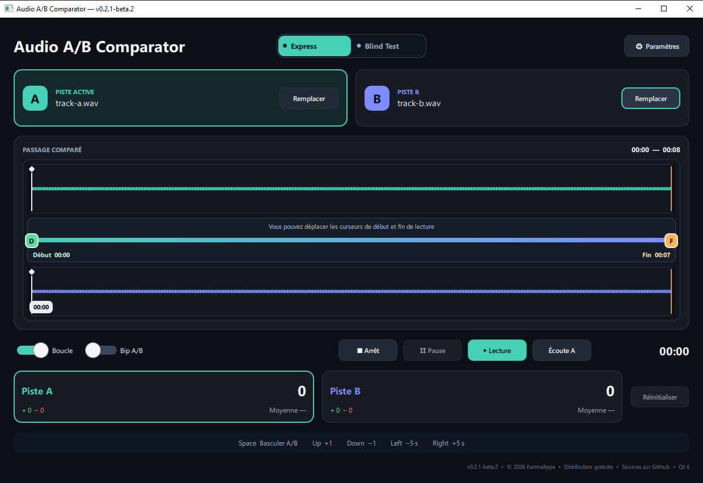
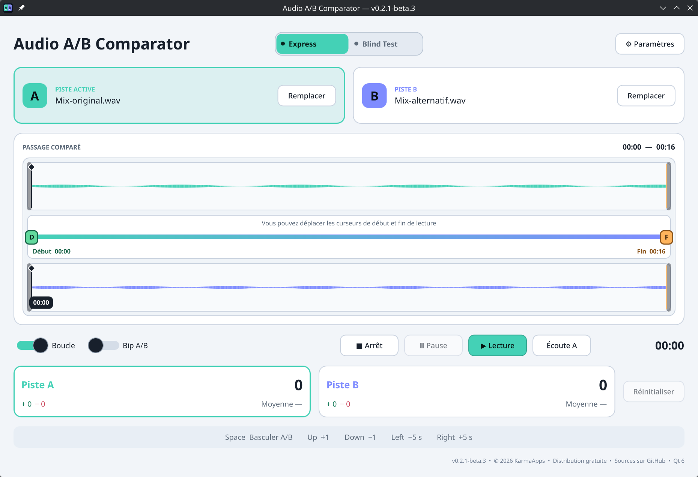
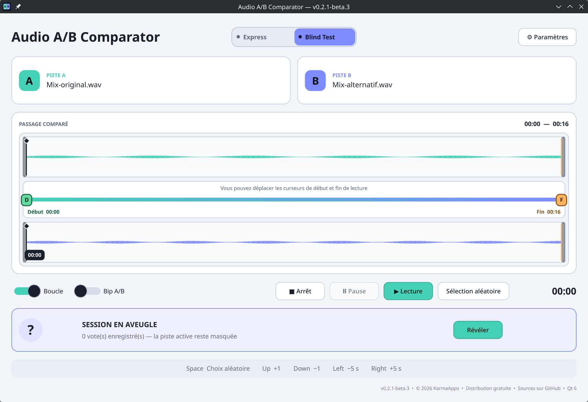
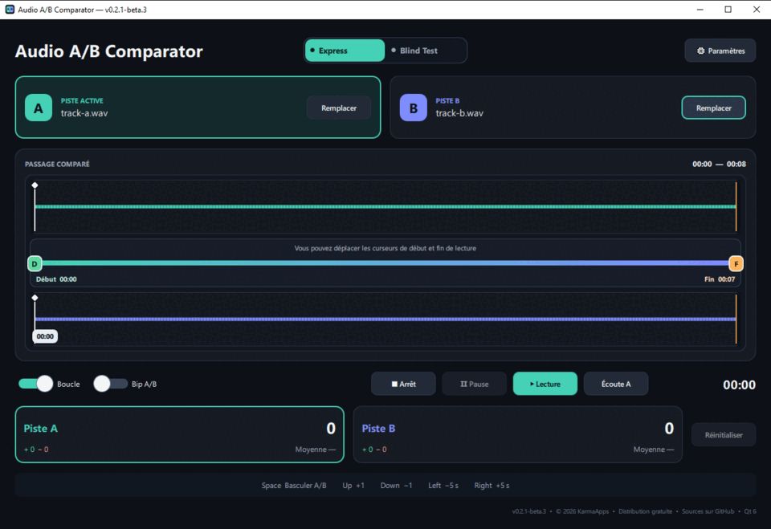

# Audio A/B Comparator

**Free and open-source A/B audio comparator for mixing, mastering and blind listening tests.**

Audio A/B Comparator is a portable desktop application by **KarmaApps by KarmaGame** for comparing two versions of a mix, master or recording. It keeps the listening workflow focused: load two local files, select one shared passage, switch instantly between A and B, and vote from the keyboard without juggling tracks in a DAW.

Everything runs locally. No audio is uploaded, and the application has no account system or telemetry. Audio paths, votes and listening sessions are not retained after closing the application.

### Dark theme



### Light theme



### Blind Test



### Demonstration



## Download

Version **0.2.1-beta.3** is available as a portable ZIP for **Windows 10 and Windows 11 x64** and as an AppImage for **Linux x86_64**. Download the binary and `SHA256SUMS` from the [GitHub Releases page](https://github.com/KarmaGame33/AudioABComparator/releases). Do not download binaries from the repository source tree.

This beta is unsigned. Windows SmartScreen may display a warning because the executable has no Authenticode signature or established reputation. Verify the SHA-256 checksum, extract the complete ZIP, then run `ab-compare.exe` from the extracted folder.

On Linux, make the AppImage executable and run it without installation:

```sh
chmod +x AudioABComparator-0.2.1-beta.3-linux-x86_64.AppImage
./AudioABComparator-0.2.1-beta.3-linux-x86_64.AppImage
```

## Features

- local WAV, FLAC, MP3, AIFF and Ogg loading through Qt Multimedia;
- shared interactive timeline, waveform overview and selection;
- play, pause, stop, loop and five-second navigation;
- instant A/B switching with a short anti-click crossfade;
- instant positive or negative voting from the keyboard without interrupting playback;
- optional A/B transition beep with adjustable volume;
- constrained random Blind Test sessions where the active track remains hidden;
- separate vote tracking and A/B score reveal at the end of a Blind Test session;
- configurable shortcuts and persistent light/dark theme;
- no account, cloud upload or telemetry.

## Planned features

The roadmap currently includes, without a fixed schedule:

- an extended analysis mode with Peak, True Peak, LUFS, LRA, RMS, crest factor and stereo correlation;
- optional, non-destructive listening-level matching between both tracks;
- more detailed meters;
- a spectrum analyser and loudness history;
- manual track offset and automatic correlation-based alignment;
- improved multichannel file support;
- a possible macOS port after native building and validation;
- a multilingual interface.

These priorities may evolve according to real-world use and feedback. All feedback is welcome, whether it concerns usability, Blind Test behaviour, shortcuts, audio compatibility or future features.

## Build on Linux

Qt 6.9 or later, CMake 3.24 or later, Ninja and a C++20 compiler are required. On Arch Linux:

```fish
sudo pacman -S --needed base-devel cmake ninja qt6-base qt6-declarative qt6-multimedia qt6-multimedia-ffmpeg qt6-wayland
cmake -S . -B build/linux-release -G Ninja -DCMAKE_BUILD_TYPE=Release
cmake --build build/linux-release --parallel (nproc)
ctest --test-dir build/linux-release --output-on-failure
```

See [`docs/installs.md`](docs/installs.md) for Windows, native Linux and reproducible AppImage build details.

## Project and contributions

This GitHub repository is the official public **mirror**. Development remains canonical in the private SVN master, and each public Git tag corresponds to an immutable SVN release tag. Issues are the feedback channel for bugs and feature requests. Pull requests are not processed for now; see [`CONTRIBUTING.md`](CONTRIBUTING.md).

Audio A/B Comparator is licensed under **GPL-3.0-or-later**. Runtime dependency notices and source links are in [`THIRD_PARTY_NOTICES.md`](THIRD_PARTY_NOTICES.md).

---

## Résumé français

**Audio A/B Comparator — KarmaApps par KarmaGame** est une application de bureau gratuite et open source destinée à comparer deux versions d’un mixage, d’un master ou d’une prise de son.

L’idée est de pouvoir se concentrer sur l’écoute, sans avoir à jongler entre plusieurs pistes dans un DAW.

Les principales fonctions sont :

- chargement de deux pistes WAV, FLAC, MP3, AIFF ou Ogg ;
- bascule instantanée entre A et B pendant la lecture ;
- timeline commune parfaitement synchronisée ;
- définition d’une zone de lecture avec points de début et de fin ;
- lecture en boucle ;
- vote instantané avec les touches du clavier, sans interrompre l’écoute ;
- mode Blind Test pour écouter et voter sans savoir quelle piste est jouée ;
- suivi des votes et révélation des pistes à la fin de la session ;
- raccourcis clavier personnalisables ;
- thèmes clair et sombre.

Tout fonctionne localement sur l’ordinateur : aucun fichier audio n’est envoyé sur un serveur et l’application ne contient ni compte utilisateur ni télémétrie. Les chemins des fichiers, les votes et les sessions d’écoute ne sont pas conservés après sa fermeture.

La bêta **0.2.1-beta.3** est proposée en ZIP portable pour **Windows 10 et Windows 11 x64** et en AppImage pour **Linux x86_64** sur la page [GitHub Releases](https://github.com/KarmaGame33/AudioABComparator/releases). Vérifiez `SHA256SUMS` avant de lancer le binaire. Sous Windows, extrayez tout le ZIP puis lancez `ab-compare.exe` ; sous Linux, rendez l’AppImage exécutable avec `chmod +x`, puis lancez-la directement. Les retours se font uniquement par les [Issues GitHub](https://github.com/KarmaGame33/AudioABComparator/issues).

Il s’agit encore d’une bêta : l’interface et le fonctionnement principal sont opérationnels, mais les essais sur différentes configurations audio restent particulièrement utiles.

### Fonctionnalités envisagées

La feuille de route prévoit notamment, sans calendrier ferme :

- un mode d’analyse étendu avec Peak, True Peak, LUFS, LRA, RMS, facteur de crête et corrélation stéréo ;
- une égalisation optionnelle et non destructive du niveau d’écoute entre les deux pistes ;
- des vumètres plus détaillés ;
- un analyseur spectral et un historique de la loudness ;
- un décalage manuel des pistes et un alignement automatique par corrélation ;
- une meilleure prise en charge des fichiers multicanaux ;
- un éventuel portage macOS après compilation et validation natives ;
- une interface multilingue.

Ces priorités pourront évoluer en fonction des usages et des retours.

**Tous les retours sont les bienvenus**, qu’ils concernent l’ergonomie, le fonctionnement du Blind Test, les raccourcis, la compatibilité audio ou les prochaines fonctionnalités. Vous pouvez signaler les problèmes reproductibles et proposer des améliorations dans les [Issues GitHub](https://github.com/KarmaGame33/AudioABComparator/issues).
